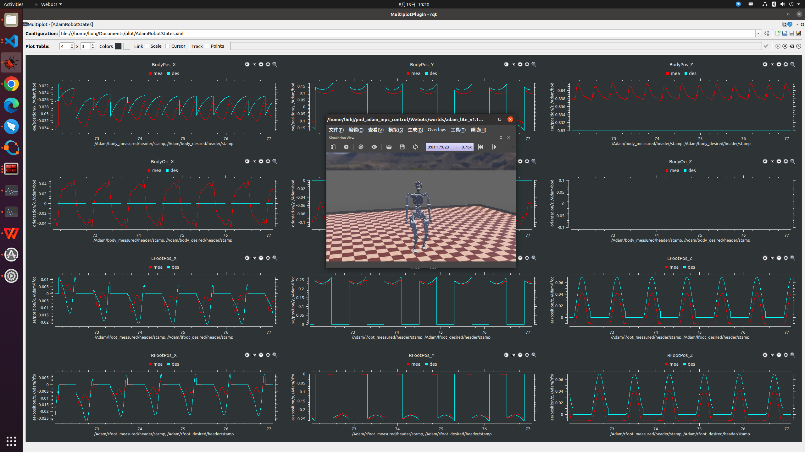
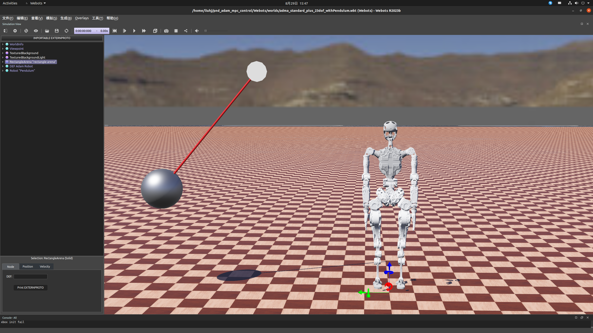

## 各版本使用及注意事项描述

### webots可用版本
adam_lite.urdf

adam_standard.urdf

standard_plus23.urdf

standard_plus29.urdf

### 实机可用版本
adam_lite.urdf

adam_standard.urdf（未测试）

standard_plus23.urdf

standard_plus29.urdf

### urdf文件对应webots仿真环境描述
adam_lite.urdf - adam_lite_v1.1_world.wbt

adam_standard.urdf - adam_standard_world.wbt

standard_plus23.urdf - adma_standard_plus_23dof_world.wbt

standard_plus29.urdf - adma_standard_plus_29dof_world.wbt

standard_plus53.urdf - adma_standard_plus_53dof_world.wbt

### 使用方法
`webots` 仿真时更换`Sources/config/pnc_config_sim.json`中`"urdf"`标签即可

`实机运行时更换` Sources/config/pnc_config_sim.json中`"urdf"`标签即可


# 功能说明

## dataPub
添加dataPub模块，进行机器人状态数据发布。可在dataPub中添加自定义数据发布，实时监看更多机器人相关状态。具体话题发布于定义见`dataPub.cpp`。
`main.cpp`中使用`#define ROS_PUB`打开机器人数据话题发布。

## rqt_multiplot
安装对应ubuntu版本`rqt_multiplot`，启动`roscore`后，另起终端输入：
```
rqt_multiplot
```
打开`plot`文件夹中的.xml文件即可查看对应机器人状态绘图。在`dataPub.cpp`修改想要使用的话题与发布的数据相关，自定义.xml文件实现自己需求的数据实时绘图监看。

## example


## 基于角动量的落足点计算
首先使用rbdl进行质心处角动量计算，详见函数`estCOMStateMomentum()`,然后使用`footholdPlan_AM()`计算落足点。打开`pnc_config_sim.json`的`use_AM_calcFootHold`启用基于接触点角动量的落足点规划。同时新加入两个相关的落足点调整参数，`l_start_offset`,`r_start_offset`,加大该偏置可以调整落足点选取，调节以达到期望的侧向落足宽度。

## 角动量数据处理
收到外部干扰时角动量可能存在脉冲突变，使用一个中值滤波器进行脉冲处理，详见`updateDataAndProcessPulse`及`calculateMedian`函数。
真机上采集到的角动量数据噪音较大，故采用与`q_dot_a`同截止频率的低通滤波器进行滤波处理，打开`#define MOMENTUM_FILT`开关即可使用。

### reference
Gong, Yukai, and Jessy Grizzle. "Angular momentum about the contact point for control of bipedal locomotion: Validation in a lip-based controller." arXiv preprint arXiv:2008.10763 (2020).

Gong, Yukai, and Jessy W. Grizzle. "Zero dynamics, pendulum models, and angular momentum in feedback control of bipedal locomotion." Journal of Dynamic Systems, Measurement, and Control 144.12 (2022): 121006.

## push recovery
`state.cpp`中打开`momentumTurnOn`开关，打开`pnc_config_sim.json`的`use_AM_calcFootHold`开关。当机器人位于`stand`状态时，监测外力冲击及扰动，实时可切换进入`uniGait`状态，随后再切回站立状态。

### xbox
更新到使用xbox手柄切换`momentumTurnOn`开关，按下右摇杆按键即可切换。

#### xbox bug
手柄摇杆按键键值映射错误，已修正。
手柄键值存在抖动，状态切换时无影响，但是使用键值突变作为状态位切换时需注意锁存一个flag作为标志，防止抖动导致状态切换异常。

### world
新增一个添加有摆锤的仿真世界，世界名为`adma_standard_plus_23dof_withPendulum.wbt`，可从中复制摆锤添加到本地世界中使用。


##
### 依赖环境
Eigen - https://gitlab.com/libeigen/eigen/-/archive/3.4.0/eigen-3.4.0.tar.gz

rbdl - https://github.com/rbdl/rbdl

qpOASES - https://github.com/coin-or/qpOASES.git

libtorch - https://download.pytorch.org/libtorch/cpu/libtorch-cxx11-abi-shared-with-deps-1.12.1%2Bcpu.zip

qt - sudo apt install qtbase5-dev

### 编译运行

#### Webots
编译： `sh buildwebotsim.sh`

清理： `sh cleanwebotsim.sh`

webots world: Webots/worlds/humanoid_test.wbt

#### 真机
编译： `sh buildrobot.sh`

清理： `sh cleanrobot.sh`

运行： `sh run.sh`

### 程序架构
#### example / Webots 
分别放置了上机和仿真的`main.cpp`

#### RobotControl:

`Robot_Constructor` 为机器人的RBDL建模

`Estimation_Operator`、`KalmanFilter` 为机器人的状态估计

`wbc_solver` 为WBC的求解

`MomentumController` 为原地抗干扰的动量控制

#### RobotInterface:

`JointInterface` 为关节控制接口

`S2P` 为脚踝的串并联转换

`wrist_S2P` 为手腕的串并联转换

`RobotInterfaceImpl` 为机器人获取状态和发送指令的具体实现，以及读绝编等

#### Sources

`joint_pd_config` 为关节的PD参数设置
`joint_abs_config` 为关节的零位
`pnc_config` 和 `pnc_config_sim` 分别是真机和仿真的WBC控制参数

`motion` 为原地动作的数据

`python_scripts` 为读绝编、设置零位的python脚本

#### StateMachine

`joystick` 为遥控器的代码

`State` 为回零、站立、行走等状态的具体实现

### 构型更改

在`Robot_Constructor`中调整`nbody`的数量，并参考现有代码填写新连杆的质心、重量惯量等参数

现有程序控制关节数量为23，将需要修改的地方替换成新关节数量

修改构型 WBC 控制算法一般无须调整，只要保证任务维度正确即可

### WBC控制

现有WBC采取对不同任务赋予不同权重的方式调整相对优先级，目前定义了5个任务：
`body_task` 为盆骨位姿任务，
`com_task` 为质心位姿任务，
`left_foot` 为左脚位姿任务，
`right_foot` 为右脚位姿任务，
`upper_joints` 为3个腰关节+8个手臂关节的关节角任务

其中盆骨、质心、左右脚的位姿均为工作空间的量，不因构型不同而变化，只需对上身关节角任务作相应调整

各任务的初始权重和PD参数在 `pnc_config` 中设定，在 `State.cpp` 各状态的 `OnEnter` 和 `run` 中会对各任务的权重做重新分配

KP/KD 1~6 的顺序是 roll pitch yaw x y z 

各关节的力矩上限和足底力上限通过 `WbcSolver::SetConstraints` 设定

`robotdata->q_a` `robotdata->q_dot_a` `robotdata->tau_a` 分别为关节的当前位置、速度和力矩

`robotdata->q_c` `robotdata->q_dot_c` `robotdata->tau_c` 分别为关节的期望位置、速度和力矩

`robotdata->q_factor` `robotdata->q_dot_factor` 分别为关节位置和速度的控制强度，从0到1控制强度逐渐变强

### Reference

Feng S, Whitman E, Xinjilefu X, et al. Optimization‐based full body control for the darpa robotics challenge[J]. Journal of field robotics, 2015, 32(2): 293-312.

Apgar T, Clary P, Green K, et al. Fast Online Trajectory Optimization for the Bipedal Robot Cassie[C]//Robotics: Science and Systems. 2018, 101: 14.

Moro F L, Sentis L. Whole-body control of humanoid robots[J]. Humanoid Robotics: A reference, Springer, Dordrecht, 2019.

